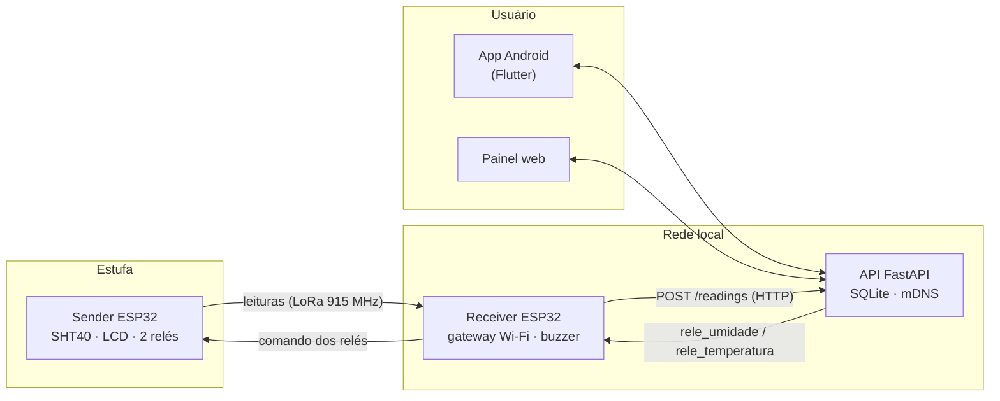

# Monitor de Estufa de Tabaco

Sistema de monitoramento e controle da cura de tabaco. Sensores ESP32 medem temperatura e umidade dentro da estufa, enviam as leituras por rádio LoRa até um gateway conectado ao Wi-Fi, e uma API guarda o histórico, avalia os limites e comanda os relés (ventoinhas, queimador, umidificador). O produtor acompanha e controla tudo pelo app Android ou pelo painel web.


## Sumário

- [Arquitetura](#arquitetura)
- [Funcionalidades](#funcionalidades)
- [Tecnologias](#tecnologias)
- [Estrutura do repositório](#estrutura-do-repositório)
- [Requisitos](#requisitos)
- [Como rodar](#como-rodar)
  - [1. API (backend)](#1-api-backend)
  - [2. Firmware ESP32](#2-firmware-esp32)
  - [3. Painel web](#3-painel-web)
  - [4. App Android](#4-app-android)
- [Configuração](#configuração)
- [Testes](#testes)
- [Solução de problemas](#solução-de-problemas)
- [Documentação complementar](#documentação-complementar)

## Arquitetura



1. O **sender** lê o SHT40 a cada 2 s, mostra os valores no LCD e transmite por LoRa. Logo depois escuta o gateway por 1,2 s e aplica nos relés o comando recebido.
2. O **receiver** encaminha cada leitura para a API, responde ao sender com o comando dos relés e toca um aviso sonoro quando uma saída liga.
3. A **API** grava o histórico, abre e fecha alertas, decide o estado das saídas e se anuncia na rede local para que o gateway e o app a encontrem sem IP fixo.
4. O **app** e o **painel web** mostram a situação da estufa em linguagem simples e permitem controlar a secagem e as saídas.

## Funcionalidades

### Monitoramento
- Temperatura (°F ou °C) e umidade relativa em tempo real, com a faixa esperada da fase destacada.
- Situação de cada estufa em uma palavra: Normal, Fora da faixa, Atenção, Crítico, Sem sinal ou Parada.
- Gráficos de 6 horas a 30 dias, com mínima, média e máxima, e exportação para planilha (CSV).
- Cura em quatro fases (Amarelação, Murchamento, Secagem da folha e Secagem do talo), cada uma com a própria faixa de temperatura e umidade. O app mostra o que falta para avançar e o produtor confirma olhando as folhas.
- Histórico colorido por fase: o fundo do gráfico e a faixa esperada mudam a cada fase.
- Duração prevista, progresso e término estimado.
- Secagem parada no meio da cura: ao ligar de novo, o produtor escolhe **continuar** a mesma estufada ou começar uma **nova estufada**. O tempo parado não conta nas horas da fase nem no término previsto.
- Sinal LoRa (RSSI/SNR) e estado online/offline de cada sensor.

### Alertas
- Regras de cada fase da cura, com níveis de atenção, crítico e emergência (ex.: na Amarelação, acima de 40 °C por 10 min é atenção e acima de 42 °C por 10 min é crítico).
- Aquecimento rápido (mais de 1,5 °C por hora em 30 min) no Murchamento e na Secagem da folha.
- Temperatura abaixo da faixa da fase, depois do aquecimento inicial.
- Estufa sem novas leituras: atenção após 90 s e crítico após 5 min (sensor, gateway ou Wi-Fi).
- Um alerta por tipo, sem repetição; ao piorar, abre um novo alerta mais grave e notifica de novo.
- Fechamento automático quando o valor volta para a faixa, com margem para não ficar abrindo e fechando. Reconhecer e resolver pelo app.

### Controle das saídas (relés)
- Dois relés no sender: **Flap** (relé 1, GPIO2) e **Ventoinha** (relé 2, GPIO3), com nome editável.
- Modos **Automático**, **Ligada** e **Desligada**.
- **Temperatura alvo**: o produtor define o alvo (em °F) e, no automático, a ventoinha liga abaixo dele e desliga ao atingi-lo (margem de 0,9 °F para o relé não ficar batendo). Sem alvo definido, a ventoinha fica desligada.
- Outras regras do automático à escolha: temperatura ou umidade fora da faixa, acima do máximo ou abaixo do mínimo.
- **Confirmação do sender**: o app mostra quando o relé realmente mudou de estado.
- Aviso sonoro de 2 s no gateway sempre que uma saída liga, repetido no celular (som e vibração).
- Histórico de acionamentos.

### App Android
- **Notificações com o app fechado**: um serviço em segundo plano avisa quando uma saída liga ou um alerta abre, sem depender de Firebase.
- **Servidor encontrado sozinho** na rede Wi-Fi (mDNS, com varredura da rede como alternativa).
- Vínculo do sensor pela câmera (QR code) ou pelo ID do controlador.
- Tema claro, escuro ou automático; interface em português do Brasil.
- Permissões pedidas só quando necessárias, com explicação e atalho para as configurações do Android.

### Segurança e dados
- Contas com senha (hash), tokens de acesso e renovação, redefinição de senha.
- Cada usuário vê apenas as próprias estufas; leituras nunca vão para a estufa de outro usuário.
- Chave opcional para o gateway (`X-API-Key`).
- Migração automática de bancos criados por versões anteriores.

## Tecnologias

| Camada | Tecnologias |
|---|---|
| **Firmware** | ESP32-S3 (Heltec WiFi LoRa 32 V3), Arduino, rádio SX1262 (`LoRaWan_APP` da Heltec) em modo ponto a ponto, WiFiManager, ESPmDNS, Preferences (NVS), `esp_timer` |
| **Sensores e atuadores** | Sensirion SHT40 (I²C), LCD 20x4 I²C, 2 módulos de relé, buzzer ativo |
| **API** | Python 3.12+, FastAPI, Uvicorn, SQLAlchemy 2, SQLite, Pydantic 2, pydantic-settings, python-zeroconf (mDNS) |
| **Painel web** | HTML, CSS e JavaScript (módulos ES, sem framework), gráficos em SVG, Web Audio |
| **App** | Flutter 3.35+ / Dart 3.9+, Material 3, `http`, `shared_preferences`, `mobile_scanner`, `audioplayers`, `flutter_foreground_task`, `flutter_local_notifications`, `multicast_dns` |
| **Testes** | pytest + TestClient (API), flutter_test (app), arduino-cli (compilação do firmware) |

## Estrutura do repositório

```
tobacco_monitoring/
├── backend/                API FastAPI
│   ├── app/
│   │   ├── core/           configuração, banco, segurança, mDNS
│   │   ├── models/         tabelas (SQLAlchemy)
│   │   ├── schemas/        validação de entrada e saída (Pydantic)
│   │   ├── routers/        rotas da API
│   │   ├── services/       regras: leituras, alertas, saídas
│   │   └── main.py         aplicação e arquivos estáticos (/app e /mobile)
│   ├── tests/              testes automáticos
│   ├── requirements.txt
│   └── .env.example
├── frontend/               painel web (servido em /app)
├── frontend_mobile/        app Flutter (Android e versão web em /mobile)
├── gateway/
│   ├── sender/sender.ino       nó da estufa
│   └── receiver/receiver.ino   gateway LoRa → Wi-Fi
└── docs/                   resumo das mudanças (Word)
```

## Requisitos

| Para | Precisa de |
|---|---|
| API | Python 3.12 ou mais novo (testado com 3.13) |
| Firmware | Arduino IDE 2 (ou `arduino-cli`) com o pacote de placas Heltec ESP32 |
| App | Flutter 3.35 ou mais novo, Android SDK (Android Studio) e JDK 17 ou mais novo |
| Hardware | 2 placas Heltec WiFi LoRa 32 V3 com antena, sensor SHT40, LCD 20x4 I²C, 2 relés e buzzer ativo |
| Rede | O computador da API, o gateway e o celular na mesma rede Wi-Fi |

## Como rodar

### 1. API (backend)

**Instalação das bibliotecas** (uma vez):

```powershell
cd backend
python -m venv venv
venv\Scripts\activate
pip install -r requirements.txt
```

No Linux ou macOS, ative o ambiente com `source venv/bin/activate`.

Para rodar os testes, instale também as dependências de desenvolvimento:

```powershell
pip install -r requirements-dev.txt
```

**Configuração** (opcional): copie `backend/.env.example` para `backend/.env` e ajuste. Sem o arquivo, a API usa valores padrão seguros para uso local.

**Executar:**

```powershell
cd backend\app
..\venv\Scripts\python -m uvicorn main:app --host 0.0.0.0 --port 8000
```

Ao iniciar, o terminal mostra `mDNS: API anunciada como _estufa._tcp.local.` com os IPs do computador.

| Endereço | O que abre |
|---|---|
| `http://<ip-do-computador>:8000/app/` | Painel web |
| `http://<ip-do-computador>:8000/mobile/` | App pelo navegador |
| `http://<ip-do-computador>:8000/docs` | Documentação interativa da API (Swagger) |
| `http://<ip-do-computador>:8000/health` | Verificação de funcionamento |

> **Windows:** na primeira execução, o Firewall pergunta se o Python pode usar a rede. Permita em **Redes privadas**. Isso libera a porta 8000 e a descoberta automática (mDNS, UDP 5353).

### 2. Firmware ESP32

**Instalação do pacote de placas:**

1. Na Arduino IDE, abra **Arquivo > Preferências** e adicione em *URLs adicionais do Gerenciador de Placas*:

   ```
   https://resource.heltec.cn/download/package_heltec_esp32_index.json
   ```

2. Em **Ferramentas > Placa > Gerenciador de Placas**, instale **Heltec ESP32 Series Dev-boards** (testado com a 3.3.8).
3. Selecione a placa **Heltec WiFi LoRa 32(V3)**.

**Instalação das bibliotecas** (**Ferramentas > Gerenciar Bibliotecas**):

| Biblioteca | Usada em | Versão testada |
|---|---|---|
| Heltec ESP32 Dev-Boards | sender e receiver (`LoRaWan_APP.h`) | 2.1.6 |
| WiFiManager (tzapu) | receiver | 2.0.17 |
| LiquidCrystal I2C | sender | 1.1.2 |
| Adafruit SHT4x Library | sender | 1.0.5 |

Com `arduino-cli`:

```bash
arduino-cli core install Heltec-esp32:esp32 --additional-urls https://resource.heltec.cn/download/package_heltec_esp32_index.json
arduino-cli lib install "Heltec ESP32 Dev-Boards" WiFiManager "LiquidCrystal I2C" "Adafruit SHT4x Library"
arduino-cli compile --fqbn Heltec-esp32:esp32:heltec_wifi_lora_32_V3 gateway/receiver
```

**Gravação:**

1. Grave `gateway/sender/sender.ino` na placa da estufa. Se houver mais de uma estufa, mude `CONTROLLER_ID` em cada sender.
2. Grave `gateway/receiver/receiver.ino` na placa do gateway.
3. Na primeira vez, o receiver cria a rede Wi-Fi **ESP32-LoRa-Gateway**. Conecte-se a ela pelo celular e escolha a rede da casa.
4. O receiver encontra a API sozinho. Para informar o endereço manualmente, segure o botão **PRG** por 3 s e preencha **Endereço da API** no portal.

Ligações do sender:

| Componente | Pino |
|---|---|
| SHT40 e LCD (I²C) | SDA GPIO4, SCL GPIO5 |
| Relé 1 (flap) | GPIO2 |
| Relé 2 (ventoinha) | GPIO3 |
| Buzzer (no receiver) | GPIO5 |

### 3. Painel web

Não precisa de instalação: a API já serve o painel em `http://<ip-do-computador>:8000/app/`. Funciona no computador, no tablet e no celular.

### 4. App Android

**Instalar o APK pronto:** copie `app-release.apk` para o celular, abra o arquivo e permita "instalar apps desconhecidos". Com o celular no mesmo Wi-Fi da API, o app encontra o servidor sozinho.

**Compilar a partir do código:**

```powershell
cd frontend_mobile
flutter pub get
flutter build apk --release
```

O arquivo sai em `frontend_mobile/build/app/outputs/flutter-apk/app-release.apk`.

Para testar com o celular conectado por USB (modo de depuração ativado):

```powershell
flutter run
```

Para atualizar a versão aberta pelo navegador em `/mobile`:

```powershell
flutter build web --release --base-href /mobile/
```

**Primeiro uso:**

1. Crie uma conta na tela de login.
2. Em **Estufas**, cadastre a estufa e vincule o sensor pelo QR code ou pelo ID (ex.: `ESP32-TOBACCO-01`).
3. Abra a estufa e toque em **Iniciar secagem**. A cura começa na Amarelação, as leituras passam a ser gravadas e os alertas passam a funcionar. Use **Avançar fase** no card Cura quando as folhas estiverem prontas.
4. Em **Saídas**, defina a **temperatura alvo** da ventoinha. O lápis muda o nome e a regra de cada relé.
5. Em **Ajustes**, ative **Avisar com o app fechado** para receber notificações.

## Configuração

Variáveis de `backend/.env` (todas opcionais):

| Variável | Padrão | Descrição |
|---|---|---|
| `ENVIRONMENT` | `development` | Em `development`, o código de redefinição de senha volta na resposta (não há e-mail configurado). Use `production` em uso real. |
| `SECRET_KEY` | gerada automaticamente | Chave de assinatura dos tokens. Sem ela, uma chave aleatória é salva em `data/secret_key`. |
| `ACCESS_TOKEN_MINUTES` | `15` | Validade do token de acesso. |
| `REFRESH_TOKEN_DAYS` | `30` | Validade da sessão. |
| `GATEWAY_API_KEY` | vazio | Quando definida, o gateway precisa enviar `X-API-Key` com o mesmo valor (`GATEWAY_API_KEY` no `receiver.ino`). |
| `CORS_ORIGINS` | `*` | Origens liberadas para o navegador, separadas por vírgula. |
| `DEVICE_OFFLINE_SECONDS` | `90` | Tempo sem leituras até o sensor aparecer como offline e o alerta "Sensor sem resposta". |
| `NO_READINGS_ALARM_SECONDS` | `300` | Tempo sem leituras, com a secagem ligada, até o alarme crítico "Estufa sem novas leituras". |
| `MDNS_ENABLED` | `true` | Anuncia a API na rede local para o gateway e o app. |
| `API_PORT` | `8000` | Porta informada no anúncio mDNS. Mude junto com `--port`. |
| `DATA_DIR` | `backend/data` | Pasta do banco SQLite e da chave secreta. |

Principais constantes do firmware:

| Arquivo | Constante | Função |
|---|---|---|
| `sender.ino` | `CONTROLLER_ID` | Identificador do sensor, usado para vincular no app |
| `sender.ino` | `RELE_LIGADO` / `RELE_DESLIGADO` | Inverta para módulos de relé ativos em nível baixo |
| `receiver.ino` | `API_FIXA` | Endereço fixo da API; vazio usa a descoberta automática |
| `receiver.ino` | `GATEWAY_API_KEY` | Mesma chave do backend, se configurada |
| ambos | `RF_FREQUENCY` e parâmetros `LORA_*` | Devem ser iguais nas duas placas |

## Testes

```powershell
# API: 58 testes (autenticação, leituras, fases, alertas, saídas, mDNS, migração)
cd backend
venv\Scripts\python -m pytest

# App: análise estática e 12 testes
cd frontend_mobile
flutter analyze
flutter test
```

O firmware pode ser verificado com `arduino-cli compile`, como mostrado em [Firmware ESP32](#2-firmware-esp32).

## Solução de problemas

| Sintoma | O que verificar |
|---|---|
| App ou gateway não encontram o servidor | Mesma rede Wi-Fi; Python liberado no Firewall em redes privadas; API rodando com `--host 0.0.0.0`. Se a rede bloquear mDNS, informe o endereço manualmente (app: **Login > Alterar**; gateway: botão **PRG** por 3 s). |
| Sensor aparece offline | Sender ligado e com antena; gateway conectado ao Wi-Fi (monitor serial a 115200); parâmetros LoRa iguais nas duas placas. |
| Leituras não aparecem no histórico | A secagem precisa estar iniciada; a API responde `202` com o motivo (`drying_not_started`, `no_curing_unit`) no monitor serial do gateway. |
| Relé não obedece ao app | Monitor serial do sender deve mostrar `RX downlink: RELAY;ID=...`; confira se o `CONTROLLER_ID` do sender é o mesmo vinculado no app. |
| Notificações não chegam com o app fechado | Em **Perfil**, confira se as notificações estão permitidas e se a bateria do app está "Sem restrições". |
| Build Android falha por memória ou JDK | Ajuste `org.gradle.jvmargs` e `org.gradle.java.home` em `frontend_mobile/android/gradle.properties` para o seu computador. |

## Documentação complementar

- [backend/README.md](backend/README.md): endpoints da API e regras de gravação das leituras.
- [gateway/README.md](gateway/README.md): protocolo LoRa, saídas, aviso sonoro e descoberta do servidor.
- [frontend/README.md](frontend/README.md): telas e estrutura do painel web.
- [frontend_mobile/README.md](frontend_mobile/README.md): telas, permissões e desenvolvimento do app.
- [docs/Resumo das mudancas.docx](docs/Resumo%20das%20mudancas.docx): resumo de todas as mudanças e dos testes.
